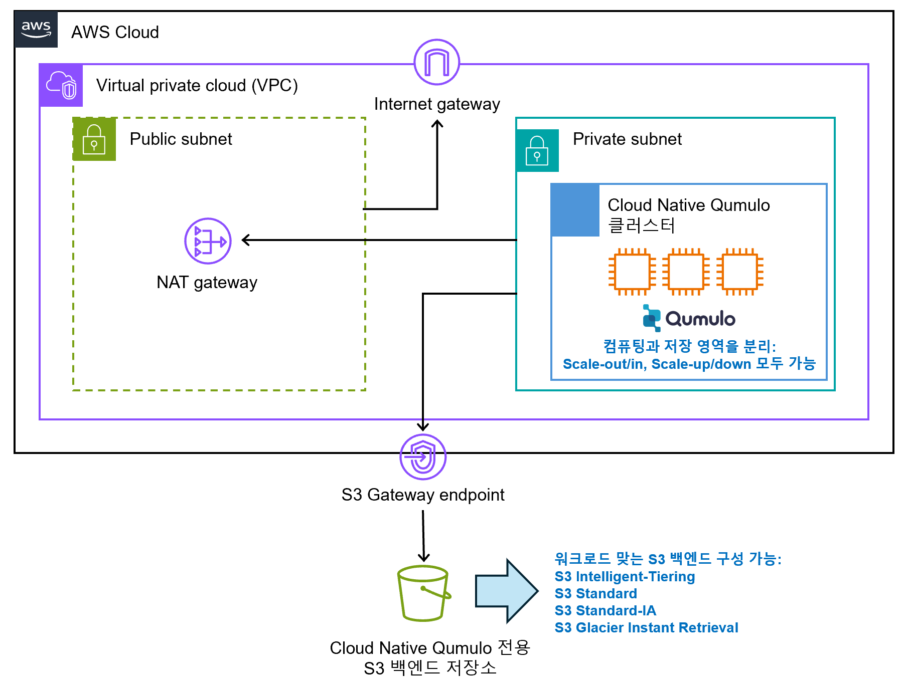

# 1. What is Cloud Native Qumulo on AWS (CNQ on AWS)?
- CNQ on AWS is Qumulo’s cloud product that fully inherits the strengths of the existing on-premises Qumulo.
- As you add more nodes, you gain scale-out performance, and all provisioned storage is treated as a single file system.
  - A cluster can store up to 18 quintillion files, and up to 4.3 billion files can be stored in a single directory.
  - Supports multi-protocol access including NFS, SMB, S3, FTP, and REST.
- EC2 is used as the compute node, and S3 is used as the backend storage, allowing for flexible configuration changes.
  - Scale-out/in: Add or remove compute nodes in the CNQ cluster.
  - Scale-up/down: Replace compute nodes with higher or lower instance types.
- Global Namespace feature allows namespace expansion across other CNQ clusters and on-prem Qumulo clusters.
- CNQ product page: https://qumulo.com/ko/product/aws/

# 2. Target Architecture
- Build a Cloud Native Qumulo (CNQ) cluster on AWS using Terraform from a Windows OS environment.
- This guide assumes a test environment; modify accordingly for production use.
- Target architecture:
  - Except for CNQ and the S3 backend storage, all other components in the diagram must be pre-configured.
    - <a href="images/aws목표구성.png">  </a>

# 3. Prepare CNQ Installation Files
- Contact your Qumulo representative and obtain the following three files corresponding to the version you want to install:
  - aws-terraform-cnq-<x.y>.zip (x.y is the version)
  - host_configuration.tar.gz
  - qumulo-core.deb
 
# 4. Upload CNQ Installation Files to S3 Bucket (CNQ Utility Bucket)
- **(Important) The S3 bucket created in this step is separate from the S3 backend storage used by CNQ. This bucket is solely for uploading installation files.**
- **(Important) It is recommended not to delete this bucket even after the installation is complete.**
- Log in to the AWS Management Console and navigate to the S3 service.
- Create a bucket and upload files as shown in the example below:
  - (Example) Amazon S3 > Buckets > ypark-cnq-utilbucket > cnq-install-files/ > qumulo-core-install/ > 7.2.3.1/
    - `ypark-cnq-utilbucket`: Any name you prefer
    - `cnq-install-files/`: Any name you prefer
    - `qumulo-core-install/`: Must be entered exactly as shown
    - `7.2.3.1/`: Enter the exact CNQ version you intend to install (e.g., 7.2.3.1/)
- Upload the provided `qumulo-core.deb` file to the CNQ version directory.
- Upload the provided `host_configuration.tar.gz` file to the same directory **without extracting the archive**.
- Example image of completed upload:
  - <a href="images/cnq install file.png">  </a>

# 5. Required AWS Preconfiguration
- **(Important) The following two conditions must be met, or the CNQ installation will fail:**
  - The **Private subnet** where CNQ will be deployed **must have internet access** (e.g., via a NAT gateway or alternative routing) in order to install required packages.
  - The **Private subnet** must be able to communicate with the S3 backend storage via **S3 Gateway Endpoint**. This ensures that S3 traffic is routed through the AWS internal network rather than the internet, **greatly reducing S3 data transfer costs**.

## Resources to be preconfigured:
- **1 VPC**
  - **1 Internet Gateway**
  - **1 S3 Gateway Endpoint**
  - **1 EC2 Keypair**
  - **1 Public Subnet**
    - Includes **1 NAT Gateway**
  - **1 Private Subnet**  
    **(Important) It is recommended to configure the Private subnet with a /24 subnet mask.**

## Routing Configuration:
- Default route of the **Public Subnet** → Internet Gateway
- Default route of the **Private Subnet** → NAT Gateway
- S3 traffic route of the **Private Subnet** → S3 Gateway Endpoint

## S3 Gateway Endpoint Setup:
- **(Important)** Enabling the S3 Gateway Endpoint allows CNQ to communicate with S3 over AWS’s internal network, minimizing S3 traffic costs.
- Navigate to: **VPC > Endpoints > Create endpoint**
- Select **Service category: AWS services**
- Under **Services**, search for `S3` and select the appropriate S3 service for the region:
  - <a href="images/s3 gw endpoint-service.png">  </a>
- Under **Type**, select **Gateway** and choose the target **VPC**:
  - <a href="images/s3 gw endpoint - type, vpc.png">  </a>
- Under **Route tables**, select the route table associated with the Private Subnet where CNQ will be installed:
  - <a href="images/s3 gw endpoint rt지정.png">  </a>
- For **Policy**, choose **Full access**
- Click **Create endpoint** to complete the creation

## To verify S3 Gateway endpoint functionality:
- Refer to: [https://repost.aws/knowledge-center/vpc-check-traffic-flow](https://repost.aws/knowledge-center/vpc-check-traffic-flow)

# 6. Firewall Policy Requirements for CNQ Installation and Monitoring (CBM)

To enable proper installation and cloud-based monitoring of CNQ, ensure that outbound traffic from the CNQ environment is allowed to reach the following destinations over **port 443 (HTTPS)**:

| Destination                         | Port |
|-------------------------------------|------|
| `api.nexus.qumulo.com`             | 443  |
| `ep1.qumulo.com`                   | 443  |
| `api.missionq.qumulo.com`         | 443  |
| `missionq-dumps.s3.amazonaws.com` | 443  |
| `monitor.qumulo.com`              | 443  |

> **Reference**: [Qumulo Monitoring and Remote Support Setup Guide](https://docs.qumulo.com/administrator-guide/monitoring-and-metrics/enabling-cloud-based-monitoring-remote-support.html)


# 7. Command Execution Tools and Terraform Variable File Editors
- You can use the default Windows command-line tool **PowerShell**, and the default text editor **Notepad**.
- It is recommended to install a development tool such as **VS Code** ([https://code.visualstudio.com/](https://code.visualstudio.com/)).
  - To use Terraform in VS Code, you must install the **HashiCorp Terraform extension**.
 
# 8. Required Application Installation
- When running VS Code or PowerShell below, make sure to **Run as administrator**.  
- Applications that need to be installed  
  - CLI‑based package‑management tool  
  - AWS CLI  
  - Terraform  

- Installing a CLI‑based package manager such as **Chocolatey** is recommended  
  - Visit Chocolatey (https://chocolatey.org/install) and follow the installation guide.  
  - After installation, verify the Chocolatey version with `choco --version`.  

  ```powershell
  # Check Chocolatey version
  choco --version
  # Sample output
  2.3.0
  - Install **awscli** with `choco install awscli`.
- Install **terraform** with `choco install terraform`.
- Verify the awscli version with `aws --version`:

  ```powershell
  # Check awscli version
  aws --version
  # Sample output
  aws-cli/2.17.32 Python/3.11.9 Windows/10 exe/AMD64
- Verify the Terraform version with terraform -version:
# Check Terraform version
terraform -version
# Sample output
Terraform v1.9.8
on windows_amd64


# 9. CNQ Setup Step 1 of 2 – Create S3 Backend Storage
- **(Important)** The overall installation has two steps.  
  1. **Step 1** creates the S3 backend storage.  
  2. **Step 2** launches the compute nodes (EC2 + Qumulo OS) and then attaches them to the S3 backend to form the final cluster.  

- **(Important)** The four buckets created in this process are *hashed* so that each lands on a different AWS S3 partition, maximizing performance.

- Extract `aws‑terraform‑cnq‑<x.y>.zip` to any directory you like.

- Open the file `aws‑terraform‑cnq‑<x.y>\persistent-storage\terraform.tfvars` in a text editor.  
  - Terraform automatically searches for a `terraform.tfvars` file in the directory where you run `terraform apply`.  
  - The `terraform.tfvars` for **S3 backend storage** is located at `aws‑terraform‑cnq‑<x.y>\persistent-storage`.  
  - The `terraform.tfvars` for **creating the CNQ cluster** itself is located at `aws‑terraform‑cnq‑<x.y>\`.

- Edit the variables in `terraform.tfvars` as shown below and save the file:

  ```terraform
  # deployment_name: Specify any name you like (32 chars max)
  deployment_name = "ypark-cnq7231-3nodes-s3be"

  # aws_region: Specify the AWS Region
  aws_region = "ap-northeast-2"

  # prevent_destroy: When true, “terraform destroy” will NOT delete the buckets,
  # preventing accidents. For production, set this to true. If false, the
  # buckets (and their data) will be deleted by “terraform destroy”.
  prevent_destroy = false

  # soft_capacity_limit: Logical capacity of the S3 backend in TB. The value
  # does not affect billing (AWS bills on actual usage). Minimum 500 TB,
  # maximum 10 000 TB (10 PB). You can increase it later.
  soft_capacity_limit = 500

  # tags: Edit if needed
  tags = null
- Open a CLI and change to the directory aws‑terraform‑cnq‑<x.y>\persistent-storage.
- Use Terraform to create the S3 backend storage for CNQ in the following order.

- Initialize the Terraform working directory
'''terraform init
# Sample output (truncated)
.... omitted ....
Terraform has been successfully initialized!
- Preview the changes, estimate impact, and validate for errors

  terraform plan
# Sample output (truncated)
.... omitted ....
aws_ssm_parameter.bucket-region: Refreshing state... [id=/qumulo/ypark-cnq7231-3nodes-s3be-WO6XIZSF1WV/bucket-region]
aws_s3_bucket.cnq_bucket[2]: Refreshing state... [id=f7favyoar5c-ypark-cnq7231-3nodes-s3be-wo6xizsf1wv-qps-3]
aws_s3_bucket.cnq_bucket[1]: Refreshing state... [id=dj7bynqnzpv-ypark-cnq7231-3nodes-s3be-wo6xizsf1wv-qps-2]
aws_s3_bucket.cnq_bucket[0]: Refreshing state... [id=x3jbivvuwds-ypark-cnq7231-3nodes-s3be-wo6xizsf1wv-qps-1]
aws_s3_bucket.cnq_bucket[3]: Refreshing state... [id=1xhlnlmxtph-ypark-cnq7231-3nodes-s3be-wo6xizsf1wv-qps-4]
.... omitted ....
Plan: 4 to add, 1 to change, 0 to destroy.


- Apply the plan to create the resources

terraform apply
# Confirm when prompted
Do you want to perform these actions?
Terraform will perform the actions described above.
Only 'yes' will be accepted to approve.
  Enter a value: yes
# Sample output (truncated)
.... omitted ....
Apply complete! Resources: 4 added, 0 changed, 0 destroyed.

Outputs:

bucket_names = [
  "x3jbivvuwds-ypark-cnq7231-3nodes-s3be-wo6xizsf1wv-qps-1",
  "dj7bynqnzpv-ypark-cnq7231-3nodes-s3be-wo6xizsf1wv-qps-2",
  "f7favyoar5c-ypark-cnq7231-3nodes-s3be-wo6xizsf1wv-qps-3",
  "1xhlnlmxtph-ypark-cnq7231-3nodes-s3be-wo6xizsf1wv-qps-4",
]
deployment_unique_name = "ypark-cnq7231-3nodes-s3be-WO6XIZSF1WV"
prevent_destroy        = false
soft_capacity_limit    = "500 TB"

- (Important) The value ypark-cnq7231-3nodes-s3be-WO6XIZSF1WV is the deployment_unique_name of the S3 backend storage. You will need this value in CNQ Setup Step 2 of 2.

- You can also verify in the AWS Management Console that four buckets containing this unique name have been created.

# 10. CNQ Deployment Step 2 of 2 – Cluster Setup

- Open the **`terraform.tfvars`** file in the directory **`aws‑terraform‑cnq‑<x.y>\`**.  
- **(Important)** Leave **`q_cluster_floating_ips = 24`** at its default value of 24.

---

### Edit and save `terraform.tfvars` as shown below

```terraform
# ****************************** Required ******************************
# ***** Terraform Variables *****
# deployment_name: specify the desired name (≤ 32 characters)
deployment_name = "ypark-cnq7231-3nodes"

# ***** S3 Bucket Variables *****
# s3_bucket_name: the name of the util bucket created earlier
s3_bucket_name = "ypark-cnq-utilbucket"
# s3_bucket_prefix: the prefix added beneath that bucket
s3_bucket_prefix = "cnq-install-files/"
# s3_bucket_region: the Region where the util bucket resides
s3_bucket_region = "ap-northeast-2"

# ***** AWS Variables *****
# aws_region: Region in which to deploy the CNQ cluster
aws_region = "ap-northeast-2"
# aws_vpc_id: ID of the pre‑created VPC for the cluster
aws_vpc_id = "vpc-0309fda56d67b0d8b"
# ec2_key_pair: the pre‑created EC2 key pair in the same Region
ec2_key_pair = "ypark-keypair-ppkfirst"
# private_subnet_id: ID of the pre‑created private subnet for the cluster
private_subnet_id = "subnet-033873efdc3efdb4e"
# term_protection: true shows a deletion warning in the AWS Console
# (recommended for production). Does NOT block `terraform destroy`.
term_protection = false

# ***** Qumulo Cluster Variables *****
# q_ami_id: leave null to let Terraform pick the latest Ubuntu AMI (recommended)
q_ami_id = null
# q_shared_ami: set to false
q_shared_ami = false
# q_debian_package: set to true
q_debian_package = true
# q_cluster_admin_password: admin password for the cluster
q_cluster_admin_password = "abcde12345!@#$%"
# q_cluster_name: name of the cluster
q_cluster_name = "ypark-cnq7231"
# q_cluster_version: must match the version folder (7.2.3.1/) you uploaded
q_cluster_version = "7.2.3.1"

# ***** Qumulo Cluster Config Options *****
# q_persistent_storage_deployment_unique_name: deployment_unique_name from Step 1
q_persistent_storage_deployment_unique_name = "ypark-cnq7231-3nodes-s3be-WO6XIZSF1WV"
# q_persistent_storage_type: hot_s3_int (default), hot_s3_std, cold_s3_ia, cold_s3_gir
q_persistent_storage_type = "hot_s3_int"
# q_instance_type: m6idn.2xlarge+, i4i.2xlarge+ or i3en.2xlarge+.
# In Seoul, only i4i instances are available.
q_instance_type = "i4i.2xlarge"
# q_node_count: number of nodes in the cluster
q_node_count = 3

# ****************************** Optional ******************************
# ***** Environment and Tag Options *****
# check_provisioner_shutdown: shut down the provisioner EC2 after install
check_provisioner_shutdown = true
# dev_environment: keep false
dev_environment = false
# tags: set if needed
tags = null

# ***** Qumulo REPLACEMENT Cluster Options *****
q_replacement_cluster = false
q_existing_deployment_unique_name = null

# ***** Qumulo Cluster Misc Options *****
kms_key_id = null
q_audit_logging = false
q_cluster_additional_sg_cidrs = null
q_cluster_additional_sg_ids = null
# q_cluster_floating_ips: number of floating IPs; keep at 24 (min 4, max 147)
q_cluster_floating_ips = 24
q_permissions_boundary = null
q_persistent_storage_bucket_policy = true

# ***** OPTIONAL module ‘route53‑phz’ *****
# Not used in this test; leave as is
q_fqdn_name = "my-dns-name.local"
q_record_name = "qumulo"
q_route53_provision = false

# ***** OPTIONAL module ‘nlb‑qumulo’ *****
# Not used in this test; leave as is
q_nlb_cross_zone = false
q_nlb_override_subnet_id = null
q_nlb_provision = false
q_nlb_stickiness = true

## Deploy the CNQ cluster with Terraform
- Initialize the Terraform working directory

'''terraform
terraform init
# Sample output
.... omitted ....
Terraform has been successfully initialized!

- Apply the plan to create resources

'''terraform
terraform apply
# Confirm with “yes” when prompted
Do you want to perform these actions?
Terraform will perform the actions described above.
Only 'yes' will be accepted to approve.

  Enter a value: yes
# Sample output (truncated)
.... omitted ....
module.qprovisioner.null_resource.provisioner_status[0] (local-exec): *****CNQ Cluster Successfully Provisioned*****
.... omitted ....
Apply complete! Resources: 61 added, 0 changed, 0 destroyed.

Outputs:

cluster_provisioned = "Success"
deployment_unique_name = "ypark-cnq7231-3nodes-OW6ELGCN9TX"
max_cluster_size = "6"
min_cluster_size = "3"
persistent_storage_bucket_names = [
  "x3jbivvuwds-ypark-cnq7231-3nodes-s3be-wo6xizsf1wv-qps-1",
  "dj7bynqnzpv-ypark-cnq7231-3nodes-s3be-wo6xizsf1wv-qps-2",
  "f7favyoar5c-ypark-cnq7231-3nodes-s3be-wo6xizsf1wv-qps-3",
  "1xhlnlmxtph-ypark-cnq7231-3nodes-s3be-wo6xizsf1wv-qps-4",
]
qumulo_floating_ips = [
  "172.17.17.13",
  "172.17.17.15",
  "172.17.17.229",
  "172.17.17.248",
  "172.17.17.252",
  "172.17.17.58",
]
qumulo_knowledge_base = "https://care.qumulo.com/hc/en-us/categories/115000637447-KNOWLEDGE-BASE"
qumulo_primary_ips = [
  "172.17.17.99",
  "172.17.17.21",
  "172.17.17.123",
]
qumulo_private_NFS = "<custom.dns>:/<NFS Export Name>"
qumulo_private_SMB = "\\<custom.dns>\\<SMB Share Name>"
qumulo_private_url = "https://<custom.dns>"
qumulo_private_url_node1 = "https://172.17.17.99"


- After a successful install

- You should see output similar to the above.

- In the AWS Management Console under EC2, verify that three EC2 instances have been launched.
- <a href="images/cnq ec2.png"></a> 
- Once installation is complete, you can further configure the EC2 instances and test access to the Qumulo GUI, Qumulo CLI, and protocols such as SMB, NFS, and S3.
