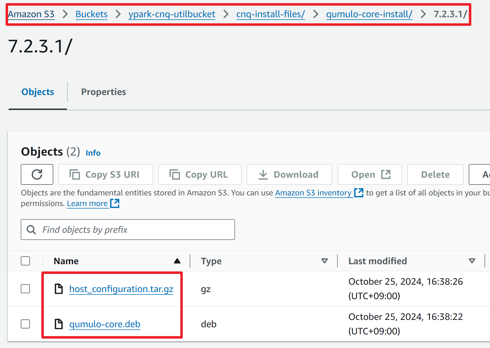

# 1. Cloud Native Qumulo on AWS（CNQ on AWS）は何ですか？
- CNQ on AWS は Qumulo のクラウド製品で、既存のオンプレミス Qumulo の利点をそのまま取り入れています  
- ノードを追加するほどスケールアウトされたパフォーマンスを提供し、構成したすべてのストレージ容量を単一のファイルシステムとして扱います  
  - クラスターあたり最大1,800京ファイルを保存可能、単一パスで最大43億ファイルを保持可能  
  - NFS、SMB、S3、FTP、REST などのマルチプロトコルをサポート  
- AWS の EC2 をコンピューティングノードとして使用し、S3 をバックエンドストレージとして活用することで柔軟な構成変更が可能  
  - **Scale‑out/in**：CNQ クラスターのコンピューティングノードを追加／削除  
  - **Scale‑up/down**：CNQ クラスターのコンピューティングノードを上位／下位インスタンスタイプに置換  
- Global Name Space 機能を使い、他の CNQ クラスターやオンプレミス Qumulo クラスターとネームスペースを拡張可能  
- CNQ 製品ページ: [https://qumulo.com/ko/product/aws/](https://qumulo.com/ko/product/aws/)

# 2. インストール目標および目標構成図
- Windows OS 環境で Terraform を使い、AWS 上に CNQ クラスターを構築  
- テスト環境を前提とし、実運用時は要件に合わせて修正が必要  
- 目標構成図  
  - CNQ と S3 バックエンド以外のリソースは事前構成が必要です  
    

# 3. CNQ インストールファイルの準備
- Qumulo 担当者から以下 3 ファイルを入手・準備してください  
  1. `aws-terraform-cnq-<x.y>.zip` （x.y はバージョン）  
  2. `host_configuration.tar.gz`  
  3. `qumulo-core.deb`

# 4. CNQ インストールファイルを S3 バケット（ユーティリティ用）にアップロード
- **（重要）この S3 バケットはバックエンド用ではなく、インストールファイル保管用です**  
- **（重要）インストール後も削除せず保持を推奨**  
1. AWS コンソールで S3 を開き、新規バケットを作成  
2. 以下のフォルダー構成でアップロード
3. ypark-cnq-utilbucket/cnq-install-files/qumulo-core-install/7.2.3.1/
3. `qumulo-core.deb` と `host_configuration.tar.gz` をそれぞれ対応ディレクトリにアップロード  
4. 完了イメージ  


# 5. 必要な AWS 事前構成
- **（重要）以下 2 条件が満たされないとインストール失敗**  
1. Private subnet が NAT や IGW 経由でインターネットアクセス可能  
2. 同サブネットに S3 Gateway エンドポイントが設定済み  
- **事前準備リソース**  
- VPC ×1  
 - Internet Gateway ×1  
 - S3 Gateway Endpoint ×1  
 - EC2 Key Pair ×1  
 - Public Subnet ×1  
   - NAT Gateway ×1  
 - Private Subnet ×1 （/24 推奨）  
- **ルーティング**  
- Public → Internet Gateway  
- Private → NAT Gateway  
- PrivateのS3 → S3 Gateway Endpoint  
- **S3 Gateway Endpoint 設定例**  
1. VPC > Endpoints > Create endpoint  
2. Service category: **AWS services**  
3. Service 名で **S3** を選択  
4. Type: **Gateway**, VPC 指定  
5. Route tables: Private Subnet のルートテーブルを選択  
6. Policy: **Full access**  
7. Create endpoint  
- 動作検証: https://repost.aws/knowledge-center/vpc-check-traffic-flow

# 6. CNQ インストール・モニタリング用ファイアウォール許可
- 次の宛先へ HTTPS(443) 許可  
- `api.nexus.qumulo.com`  
- `ep1.qumulo.com`  
- `api.missionq.qumulo.com`  
- `missionq-dumps.s3.amazonaws.com`  
- `monitor.qumulo.com`  
- 参考: [Cloud-Based Monitoring & Remote Support](https://docs.qumulo.com/administrator-guide/monitoring-and-metrics/enabling-cloud-based-monitoring-remote-support.html)

# 7. コマンド実行ツール & tfvars 編集ツール
- Windows 標準 PowerShell＆メモ帳で可  
- VS Code 推奨（[ダウンロード](https://code.visualstudio.com/)）  
- HashiCorp Terraform extension をインストール

# 8. 必要アプリケーションのインストール
- PowerShell/VS Code は「管理者権限で実行」  
- 推奨ツール  
1. CLI パッケージマネージャー（Chocolatey 等）  
  ```powershell
  # インストール後にバージョン確認
  choco --version   # 例: 2.3.0
  ```  
2. AWS CLI  
  ```powershell
  choco install awscli
  aws --version     # 例: aws-cli/2.17.32 Python/3.11.9 Windows/10 exe/AMD64
  ```  
3. Terraform  
  ```powershell
  choco install terraform
  terraform -version  # 例: Terraform v1.9.8 on windows_amd64
  ```

# 9. CNQ 構成ステップ1／2 – S3 バックエンド生成
- **ステップ1**: S3 バックエンドストレージの作成  
1. `aws-terraform-cnq-<x.y>.zip` を展開  
2. `persistent-storage/terraform.tfvars` を編集  
  ```hcl
  deployment_name     = "ypark-cnq7231-3nodes-s3be"
  aws_region          = "ap-northeast-2"
  prevent_destroy     = false
  soft_capacity_limit = 500
  tags                = null
  ```  
3. 以下を実行  
  ```bash
  terraform init
  terraform plan
  terraform apply  # yes を入力
  ```  
4. 出力された `deployment_unique_name`（例: `ypark-cnq7231-3nodes-s3be-WO6XIZSF1WV`）をメモ

# 10. CNQ 構成ステップ2／2 – クラスター構築
1. `terraform.tfvars` を開き、以下を編集  
```hcl
deployment_name                            = "ypark-cnq7231-3nodes"
s3_bucket_name                             = "ypark-cnq-utilbucket"
s3_bucket_prefix                           = "cnq-install-files/"
s3_bucket_region                           = "ap-northeast-2"
aws_region                                 = "ap-northeast-2"
aws_vpc_id                                 = "vpc-0309fda56d67b0d8b"
ec2_key_pair                               = "ypark-keypair-ppkfirst"
private_subnet_id                          = "subnet-033873efdc3efdb4e"
term_protection                            = false
q_cluster_admin_password                   = "abcde12345!@#$%"
q_cluster_name                             = "ypark-cnq7231"
q_cluster_version                          = "7.2.3.1"
q_persistent_storage_deployment_unique_name = "ypark-cnq7231-3nodes-s3be-WO6XIZSF1WV"
q_persistent_storage_type                  = "hot_s3_int"
q_instance_type                            = "i4i.2xlarge"
q_node_count                               = 3
q_cluster_floating_ips                     = 24

