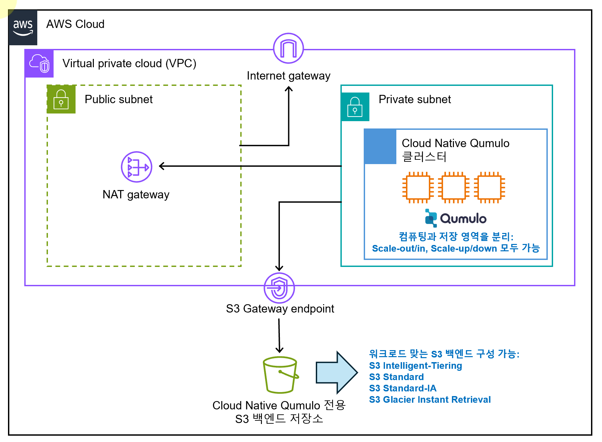

1. Cloud Native Qumulo on AWS（CNQ on AWS）とは何ですか？
CNQ on AWS は Qumulo のクラウド製品で、既存のオンプレミス Qumulo の利点をそのまま取り入れています。

ノードを追加するほどスケールアウトされたパフォーマンスを発揮し、構成したすべてのストレージ容量が単一のファイルシステムとして扱われます。

クラスターあたり最大1,800京ファイルの保存が可能、単一パスに最大43億ファイルを保持可能

NFS、SMB、S3、FTP、REST などマルチプロトコルをサポート

AWS の EC2 をコンピューティングノードとして用い、S3 をバックエンドストレージとして利用することで柔軟な構成変更が可能です。

Scale-out/in：CNQ クラスターのコンピューティングノードを追加／削除

Scale-up/down：CNQ クラスターのコンピューティングノードを上位／下位インスタンスタイプに置換

グローバルネームスペース機能により、他の CNQ クラスターやオンプレミス Qumulo クラスターとのネームスペースを拡張できます。

CNQ 製品ページ： https://qumulo.com/ko/product/aws/

2. インストール目標および目標構成図
Windows OS 環境で Terraform を使用し、AWS 上に Cloud Native Qumulo（CNQ）クラスターを構築する

テスト環境を前提としており、実運用環境では要件に応じて適宜修正が必要

目標構成図

下図の構成では CNQ および S3 バックエンドストレージ以外のリソースは事前に準備が必要です。

3. CNQ インストールファイルの準備
Qumulo 担当者と連絡を取り、ご希望のバージョンに対応する以下 3 つのファイルを入手・準備してください。

aws-terraform-cnq-<x.y>.zip（x.y はバージョン番号）

host_configuration.tar.gz

qumulo-core.deb

4. CNQ インストールファイルを S3 バケット（CNQ 用ユーティリティバケット）にアップロード
（重要）この過程で作成する S3 バケットは、CNQ のバックエンドストレージ用 S3 バケットとは別もので、インストールファイルを一時的に保管するためのものです。

（重要）インストール完了後も削除せずに保持することを推奨します。

AWS マネジメントコンソールで S3 を開き、新しいバケットを作成

以下のようなフォルダー構造を作成し、ファイルをアップロード

markdown
복사
편집
ypark-cnq-utilbucket/
  └ cnq-install-files/
      └ qumulo-core-install/
          └ 7.2.3.1/
ypark-cnq-utilbucket：任意のバケット名

cnq-install-files/：任意のプレフィックス名

qumulo-core-install/：固定

7.2.3.1/：インストールする CNQ バージョンに合わせて正確に入力

qumulo-core.deb と host_configuration.tar.gz をそれぞれバージョンフォルダー内にアップロード

host_configuration.tar.gz は展開せず、アーカイブのままアップロード

完了例（スクリーンショット）

5. 必要な AWS 事前構成
（重要）以下の 2 つの条件が満たされていないとインストールは失敗します。

CNQ を配置するプライベートサブネットが、必要なパッケージをインストールできるよう、NAT ゲートウェイまたはインターネットルートを通じてインターネットにアクセス可能であること

プライベートサブネットが S3 バックエンドストレージと通信するために、S3 Gateway エンドポイントが設定されていること

S3 Gateway エンドポイントを利用すると、CNQ からの S3 トラフィックがインターネットを経由せず AWS 内部ネットワークで通信でき、トラフィックコストを大幅に削減できます。

事前に準備するリソース

VPC ×1

Internet Gateway ×1

S3 Gateway Endpoint ×1

EC2 Key Pair ×1

Public Subnet ×1

NAT Gateway ×1

Private Subnet ×1

サブネットマスクは /24 を推奨

ルーティング設定

Public Subnet：デフォルトルート → Internet Gateway

Private Subnet：デフォルトルート → NAT Gateway

Private Subnet：S3 通信用ルート → S3 Gateway Endpoint

S3 Gateway Endpoint の設定手順

VPC > Endpoints > Create endpoint

Service category：AWS services

Services：S3 を検索し、対象リージョンの S3 サービスを選択

Type：Gateway／VPC を選択

Route tables：CNQ を配置する Private Subnet のルートテーブルを指定

Policy：Full access を選択

「Create endpoint」をクリックして作成

動作検証

https://repost.aws/knowledge-center/vpc-check-traffic-flow

6. CNQ インストールおよびモニタリング（CBM）用ファイアウォールポリシー
以下の宛先へ HTTPS（443）通信を許可してください。

api.nexus.qumulo.com

ep1.qumulo.com

api.missionq.qumulo.com

missionq-dumps.s3.amazonaws.com

monitor.qumulo.com

詳細： https://docs.qumulo.com/administrator-guide/monitoring-and-metrics/enabling-cloud-based-monitoring-remote-support.html

7. コマンド実行ツールおよび Terraform 変数ファイル編集ツール
Windows 標準の PowerShell とメモ帳で操作可能

開発効率を高めるため、VS Code の利用を推奨（https://code.visualstudio.com/）

Terraform 用に HashiCorp Terraform 拡張機能をインストール

8. 必要アプリケーションのインストール
PowerShell や VS Code を「管理者権限で実行」してください

インストール推奨アプリケーション一覧：

CLI ベースのパッケージ管理ツール（例：Chocolatey）

AWS CLI

Terraform

Chocolatey のインストール例

powershell
복사
편집
# Chocolatey インストール後バージョン確認
choco --version
# 例: 2.3.0
AWS CLI インストール

powershell
복사
편집
choco install awscli
aws --version
# 例: aws-cli/2.17.32 Python/3.11.9 Windows/10 exe/AMD64
Terraform インストール

powershell
복사
편집
choco install terraform
terraform -version
# 例: Terraform v1.9.8 on windows_amd64
9. CNQ 構成 1/2 ステップ – S3 バックエンドストレージ作成
（重要）インストールは 2 ステップに分かれており、ステップ1 で S3 バックエンドストレージを作成し、ステップ2 でコンピューティングノードを構築してクラスターを完成させます。

（重要）ステップ1 で生成される 4 つのバケットは「ハッシュ」され、異なる AWS S3 パーティションへ分散されることでパフォーマンスを最大化します。

aws-terraform-cnq-<x.y>.zip を任意のディレクトリに展開

展開先の persistent-storage/terraform.tfvars をテキストエディタで開く

Terraform は terraform.tfvars を自動検出して適用します。

以下の例を参考に変数を編集し、保存

hcl
복사
편집
# デプロイメント名（32文字以内）
deployment_name         = "ypark-cnq7231-3nodes-s3be"
# リージョン
aws_region              = "ap-northeast-2"
# バケット破壊防止
prevent_destroy         = false
# ソフト容量制限（TB 単位、最小 500～最大 10000TB）
soft_capacity_limit     = 500
# タグ（必要に応じて）
tags                    = null
PowerShell で persistent-storage ディレクトリへ移動し、以下を実行

bash
복사
편집
terraform init      # 初期化
terraform plan      # 変更内容確認
terraform apply     # 実行 → yes を入力
実行後、S3 バケット名と deployment_unique_name が出力されます。

例: ypark-cnq7231-3nodes-s3be-WO6XIZSF1WV はステップ2 で使用します。

10. CNQ 構成 2/2 ステップ – クラスター構築
aws-terraform-cnq-<x.y>/terraform.tfvars を開く

q_cluster_floating_ips = 24 はデフォルトのまま 24 を使用することを推奨

変数を以下のように編集し、保存

h
복사
편집
# 必須設定
deployment_name                        = "ypark-cnq7231-3nodes"
s3_bucket_name                         = "ypark-cnq-utilbucket"
s3_bucket_prefix                       = "cnq-install-files/"
s3_bucket_region                       = "ap-northeast-2"
aws_region                             = "ap-northeast-2"
aws_vpc_id                             = "vpc-0309fda56d67b0d8b"
ec2_key_pair                           = "ypark-keypair-ppkfirst"
private_subnet_id                      = "subnet-033873efdc3efdb4e"
term_protection                        = false

q_ami_id                               = null
q_shared_ami                           = false
q_debian_package                       = true
q_cluster_admin_password               = "abcde12345!@#$%"
q_cluster_name                         = "ypark-cnq7231"
q_cluster_version                      = "7.2.3.1"

q_persistent_storage_deployment_unique_name = "ypark-cnq7231-3nodes-s3be-WO6XIZSF1WV"
q_persistent_storage_type             = "hot_s3_int"
q_instance_type                        = "i4i.2xlarge"
q_node_count                           = 3

check_provisioner_shutdown             = true
dev_environment                        = false
tags                                   = null

q_replacement_cluster                  = false
q_existing_deployment_unique_name      = null
kms_key_id                             = null
q_audit_logging                        = false
q_cluster_additional_sg_cidrs          = null
q_cluster_additional_sg_ids            = null
q_cluster_floating_ips                 = 24
q_permissions_boundary                 = null
q_persistent_storage_bucket_policy     = true

q_fqdn_name                            = "my-dns-name.local"
q_record_name                          = "qumulo"
q_route53_provision                    = false

q_nlb_cross_zone                       = false
q_nlb_override_subnet_id               = null
q_nlb_provision                        = false
q_nlb_stickiness                       = true
PowerShell でトップディレクトリへ移動し、以下を実行

bash
복사
편집
terraform init
terraform plan
terraform apply   # yes を入力
クラスターのプロビジョニングが完了すると、次のような出力例が表示されます。

swift
복사
편집
module.qprovisioner.null_resource.provisioner_status[0]: *****CNQ Cluster Successfully Provisioned*****
Apply complete! Resources: 61 added, 0 changed, 0 destroyed.
Outputs:
  cluster_provisioned                = "Success"
  deployment_unique_name             = "ypark-cnq7231-3nodes-OW6ELGCN9TX"
  max_cluster_size                   = "6"
  min_cluster_size                   = "3"
  persistent_storage_bucket_names    = [...]
  qumulo_floating_ips                = [...]
  qumulo_primary_ips                 = [...]
  qumulo_private_NFS                 = "<custom.dns>:/<NFS Export Name>"
  qumulo_private_SMB                 = "\\<custom.dns>\\<SMB Share Name>"
  qumulo_private_url                 = "https://<custom.dns>"
  qumulo_private_url_node1           = "https://172.17.17.99"
AWS コンソールの EC2 セクションで、3 つのインスタンスが起動していることを確認できます。

インストール完了後は、追加設定を行い Qumulo GUI／CLI へのアクセスや SMB、NFS、S3 の動作確認を行ってください。
